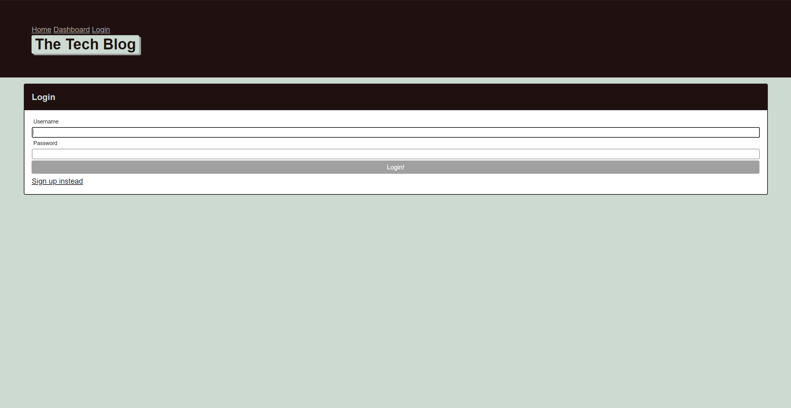

 # MVC Tech-Blog
# License: 

# Table of Contents 
* [Description](#description)
* [Usecase](#Usecase)
* [Installation](#installation)
* [Contributors](#contributors)
* [License](#license)
* [Questions](#questions)
    
## Description: 
using handlebars and SQL create a blog that allows users to post and comment within the blog with other users 
## Installation: 
npm install
## Usecase: 
gives developers a platform to discuss issues and new technologies
## License: 
[Unlicensed](Unlicensed.txt)
## Contributors: 
Nich Parson
## Testing: 
none
## Questions: 
Contact me by the following for any questions:
* Github:(https://github.com/https://github.com/Nparson88)
* Email: nparson88@gmail.com 
## Screenshots
* 
* 
## heroku deployment
(https://peaceful-citadel-02461.herokuapp.com/)